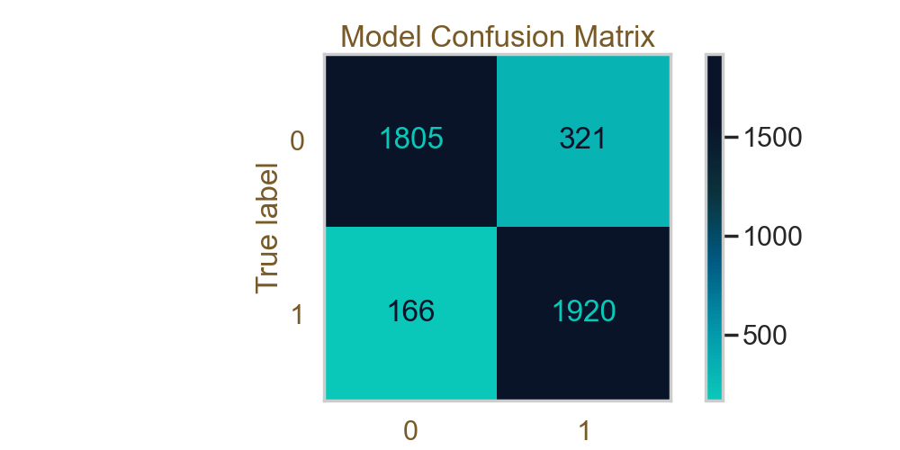

# League of Legends Dragon Analysis

Author: Katelyn Zhao

## Overview

A comprehensive data science project completed for DSC80 at UCSD. The project encompasses all components of statistical analysis, starting with exploratory data analysis, followed by hypothesis testing and prediction models. The primary focus of this project is to analyze the relationships between in game neutral objectives (specifically Dragons) and game outcome. 

## Introduction

### Gameplay

League of Legends (LoL) is a multiplayer online battle arena (MOBA) game developed and published by Riot Games. It has become one of the most popular and influential video games in esports. 

In League of Legends, two teams of five players each compete to destroy the opposing team's Nexus, a structure located in the heart of their base, protected by turrets and defensive structures. Each player controls a unique character known as a "champion" each with distinct abilities, playstyles, and roles. Players gain gold and experience by defeating enemy minions, enemy champions, enemy structures, and neutral objectives, which they use to purchase items that enhance their champion's abilities and strength.

### Data

In this project, I will focus mainly on team neutral objectives (specifically Dragons) and how they effect game outcome. To do this, I will use data collected from [Oracle's Elixir](https://oracleselixir.com/tools/downloads). I will use the game data specifically from the year 2022, containing 148992 rows and 131 columns. 

### Columns

The columns that are relevant to the analysis are as follows:

- `gameid`: a unique id for every individual game

- `league`: the regional league in which the game was played

- `teamname`: the name of the team that played in each specific game

- `side`: the side of the map the team's Nexus resides

- `result`: the outcome of the game

- `gamelength`: the length of the game in seconds

- `firstdragon`: binary variable where 1 indicates the team got the first dragon and 0 indicates that the team did not get the first dragon

- `dragons`: the total number of dragons a team takes throughout the entire game (elemental and elder)

- `elementaldrakes`: the total number of elemental dragons a team takes throughout the game

- `infernals`: the total number of infernal dragons a team takes; infernal souls provide damage buffs

- `mountains`: the total number of mountain dragons a team takes; mountain souls provide resistance buffs

- `clouds`: the total number of cloud dragons a team takes; cloud souls provide movement speed buffs

- `oceans`: the total number of ocean dragons a team takes; ocean souls provide healing buffs

- `chemtechs` : the total number of chemtech dragons a team takes; chemtech souls provide tenacity and shielding buffs

- `hextechs`: the total number of hextech dragons a team takes; hextech souls provide attack speed buffs

- `elders`: the total number of elder dragons a team takes; elder dragons provide a lot of stats and is the most powerful buff in the game

## Data Cleaning and Exploratory Analysis

### Data Cleaning

The following outlines my data cleaning process:

1. I kept only the columns needed for my analysis. Those specific columns and their descriptions are listed above.
2. I filtered out any columns that didn't have complete data. I noticed that most of the columns with partial data didn't contain information about what kind of elemental dragons were taken throughout the game. Since this information is critical in my analysis of netural objectives, I decided to drop all rows that were incomplete.
3. I grouped the data by `gameid` and `teamname` so that each row in the dataframe contains information about a single game. Since I wanted to analyze team objectives and not individual player statistics, this was the best way to store the data. 
4. I created a new column called `soultype` which specifies the type of elemental dragon soul buff a team got. In League of Legends, a team can get a buff called the dragon soul when they take 4 elemental dragons. There are 6 types of elemental dragons, and therefore 6 types of elemental dragon souls. Each of these 6 souls provide different types of buffs (described above). Each of these buffs have certain levels of power (not all of them are the same in terms of how beneficial they are for a team). If a team was unable to get the buff, the value in the column is 'none'.

The head of the cleaned dataframe is displayed below.

| gameid                | teamname                      | league   | side   |   result |   gamelength |   firstdragon |   dragons |   elementaldrakes |   infernals |   mountains |   clouds |   oceans |   chemtechs |   hextechs |   elders | soultype   |
|:----------------------|:------------------------------|:---------|:-------|---------:|-------------:|--------------:|----------:|------------------:|------------:|------------:|---------:|---------:|------------:|-----------:|---------:|:-----------|
| ESPORTSTMNT01_2690210 | Fredit BRION Challengers      | LCKC     | Blue   |        0 |         1713 |             0 |         1 |                 1 |           0 |           0 |        0 |        0 |           0 |          1 |        0 | none       |
| ESPORTSTMNT01_2690210 | Nongshim RedForce Challengers | LCKC     | Red    |        1 |         1713 |             1 |         3 |                 3 |           2 |           1 |        0 |        0 |           0 |          0 |        0 | none       |
| ESPORTSTMNT01_2690219 | Liiv SANDBOX Challengers      | LCKC     | Red    |        1 |         2114 |             1 |         4 |                 4 |           0 |           2 |        1 |        0 |           0 |          1 |        0 | mountains  |
| ESPORTSTMNT01_2690219 | T1 Challengers                | LCKC     | Blue   |        0 |         2114 |             0 |         1 |                 1 |           0 |           1 |        0 |        0 |           0 |          0 |        0 | none       |
| ESPORTSTMNT01_2690227 | Gen.G Challengers             | LCKC     | Red    |        0 |         1972 |             0 |         1 |                 1 |           0 |           0 |        0 |        0 |           0 |          1 |        0 | none       |

### Univariate Analysis

In the first part of my exploratory data analysis, I want to look at the distributions of single variables.

First, I'm going to look at the distribution of the total number of dragons (both elemental and elder) that a team takes per game.

<iframe
  src="assets/total-dragon-dist.html"
  width="800"
  height="600"
  frameborder="0"
></iframe>

Now, I'm going to look at the frequencies of the different types of elemental dragons.

<iframe
  src="assets/elemental-dragon-dist.html"
  width="800"
  height="600"
  frameborder="0"
></iframe>

After some research, I found that the chemtech drake was disabled January 24th of 2022, which is why the frequency of this dragon is so low compared to others. It was later updated and reintroduced in November of 2023.

### Bivariate Analysis

In this next part of my exploratory analysis, I want to look at the relationships between multiple variables.

Below is a visual representation of the winrates of teams who took the first dragon and teams that did not take the first dragon. Based on the figure, it looks like teams that take the first dragon win more than teams that did not take the first dragon.

<iframe
  src="assets/first-drake-winrate.html"
  width="800"
  height="600"
  frameborder="0"
></iframe>

I also looked at the winrate of each of the different types of elemental dragon souls. It is commonly said that the Hextech Soul is the most powerful buff of the 6 souls, which is reflected in the plot. Is this difference significant? I will explore this idea later in my analysis.

<iframe
  src="assets/soul-winrate.html"
  width="800"
  height="600"
  frameborder="0"
></iframe>

### Interesting Aggregates

To look at some of the combined data for each of the 8 tier-one regions, I grouped by the `league` column and found the sum of the `result`, `dragons`, and `firstdragon` columns and the mean of the `gamelength` column. Note that the LPL (League of Legends Pro League), which is the professional league for League of Legends in China, is not included because most of their data was of partial completion, meaning it was dropped in the data cleaning stage. The LCK (League of Legends Champions Korea) has the highest numbers in all columns, which is unsurprising since they are often considered the strongest region.

| league   |   result |   gamelength |   dragons |   firstdragon |
|:---------|---------:|-------------:|----------:|--------------:|
| LCK      |      467 |      2020.06 |      2253 |           467 |
| LEC      |      201 |      2009.46 |       925 |           201 |
| LCS      |      304 |      1981.43 |      1382 |           304 |
| PCS      |      271 |      1858.03 |      1192 |           271 |
| VCS      |      323 |      1800.96 |      1334 |           323 |
| CBLOL    |      243 |      1974.09 |      1123 |           243 |
| LLA      |      187 |      1989.54 |       844 |           187 |

## Assessment of Missingness

### NMAR Analysis

Columns in my dataset that could be considered NMAR are the columns for specific types of elemental dragons taken like `infernals`, `mountains`, `clouds`, etc. If some regions do not report this specific data, there would be missing values.

### Missingness Dependency

In this part, I will be testing the missingness of the `firstdragon` column on other columns in the dataset. I believe that the missingness of the values in the column may be dependent on the `league` or `side` columns.

First, I will look at the distribution of `league` when `firstdragon` is missing vs not missing.

**Null Hypothesis:** the distribution of the `league` column when `firstdragon` is missing is the same as the distribution of the `league` column when `firstdragon` is not missing.

**Alternate Hypothesis:** the distribution of the `league` column when `firstdragon` is missing is not the same as the distribution of the `league` column when `firstdragon` is not missing.

The test statistic used was **Total Variation Distance (TVD)** and the significance level chosen was **0.05**.

Below is the observed distribution of `league` when `firstdragon` is missing and not missing.

| league     |   firstdragon_missing = False |   firstdragon_missing = True |
|:-----------|------------------------------:|-----------------------------:|
| CBLOL      |                    0.022995   |                   0          |
| CBLOLA     |                    0.02044    |                   0          |
| CDF        |                    0.00690797 |                   0          |
| CT         |                    0.00246037 |                   0          |
| DCup       |                    0          |                   0.0396913  |
| DDH        |                    0.0197776  |                   0          |
| EBL        |                    0.016986   |                   0          |
| EL         |                    0.012775   |                   0          |
| ESLOL      |                    0.0229004  |                   0          |
| EUM        |                    0.0252661  |                   0          |
| GL         |                    0.0160871  |                   0          |
| GLL        |                    0.0191152  |                   0          |
| HC         |                    0.0151408  |                   0          |
| HM         |                    0.0144784  |                   0          |
| IC         |                    0.00709723 |                   0          |
| LAS        |                    0.021481   |                   0          |
| LCK        |                    0.0441921  |                   0          |
| LCKC       |                    0.0372841  |                   0          |
| LCL        |                    0.00151408 |                   0          |
| LCO        |                    0.0200615  |                   0          |
| LCS        |                    0.0289567  |                   0          |
| LCSA       |                    0.0511001  |                   0          |
| LDL        |                    0          |                   0.519294   |
| LEC        |                    0.022995   |                   0          |
| LFL        |                    0.0233736  |                   0          |
| LFL2       |                    0.0228058  |                   0          |
| LHE        |                    0.022995   |                   0          |
| LJL        |                    0.0202508  |                   0          |
| LJLA       |                    0.00359593 |                   0          |
| LLA        |                    0.0176958  |                   0          |
| LMF        |                    0.0301869  |                   0          |
| LPL        |                    0          |                   0.433297   |
| LPLOL      |                    0.0194937  |                   0          |
| LVP SL     |                    0.0231843  |                   0          |
| MSI        |                    0.00757038 |                   0          |
| NEXO       |                    0.0181216  |                   0          |
| NLC        |                    0.0362432  |                   0          |
| PCS        |                    0.0256447  |                   0          |
| PGC        |                    0.0531819  |                   0          |
| PGN        |                    0.0140998  |                   0          |
| PRM        |                    0.0343033  |                   0          |
| SL (LATAM) |                    0.0152354  |                   0          |
| TAL        |                    0.0193991  |                   0          |
| TCL        |                    0.0209132  |                   0          |
| UL         |                    0.0230897  |                   0          |
| UPL        |                    0.0389875  |                   0          |
| VCS        |                    0.0305654  |                   0          |
| VL         |                    0.0157085  |                   0          |
| WLDs       |                    0.0133428  |                   0.00771775 |

Below is the empirical distribution of the test statistics.

<iframe
  src="assets/empirical-dist-league.html"
  width="800"
  height="600"
  frameborder="0"
></iframe>

After the permutation test, I found that the observed test statistic was **0.9922822491730982** and the p-value obtained was **0**. Therefore, I reject the null hypothesis and conclude that `firstdragon` is MAR, conditional on `league`.

I will now look at the distribution of `side` when `firstdragon` is missing vs not missing.

**Null Hypothesis:** the distribution of the `side` column when `firstdragon` is missing is the same as the distribution of the `side` column when `firstdragon` is not missing.

**Alternate Hypothesis:** the distribution of the `side` column when `firstdragon` is missing is not the same as the distribution of the `side` column when `firstdragon` is not missing.

The test statistic used was **Total Variation Distance (TVD)** and the significance level chosen was **0.05**.

Below is the observed distribution of `side` when `firstdragon` is missing and not missing.

| side   |   firstdragon_missing = False |   firstdragon_missing = True |
|:-------|------------------------------:|-----------------------------:|
| Blue   |                      0.498699 |                     0.498622 |
| Red    |                      0.501301 |                     0.501378 |

Below is the empirical distribution of the test statistics.

<iframe
  src="assets/empirical-dist-side.html"
  width="800"
  height="600"
  frameborder="0"
></iframe>

After the permutation test, I found that the observed test statistic was **0.00007701057594522442** and the p-value obtained was **0.978**. Therefore, I fail to reject the null hypothesis. However, we cannot conclude that this column is MCAR, only that it is not MAR, conditional on `side`.

## Hypothesis Testing

We saw from the graphs above that hextech souls seem to have the highest winrate of all the different elemental souls. Is this difference significant? Or is it just by chance?

In other words, is the winrate for teams that get hextech soul significantly higher than the winrate for teams that get the other types of souls?

To answer this question, a hypothesis test was conducted and the results are shown below.

Null Hypothesis: In the population, the results of hextech souls and other elemental souls have the same distribution, and the observed differences in the samples are due to random chance.

Alternative Hypothesis: In the population, hextech souls have higher winrates than other elemental souls, on average. The observed difference in the samples cannot be explained by random chance alone.

Test-Statistic: Difference in group means (mean # of wins of hextech souls - mean # wins of other elemental souls)

Significance Level: 0.05

Below is the empricial distribution of the test statistics.

<iframe
  src="assets/empirical-dist-permutation.html"
  width="800"
  height="600"
  frameborder="0"
></iframe>

After doing the permutation test, I found that the observed test statistic was **0.034431828298115086** and the p-value that I obtained was **0.0035**. Since the p-value is less than the chosen significance level, we reject the null hypothesis.

## Framing a Prediction Problem

So far, I've only been focused on dragons, a type a neutral objective in Leauge of Legends. Now, I want to deepen my analysis by expanding the reach to look at all neutral objectives including Elemental Dragons, Elder Dragons, Barons, and Rift Heralds. Note that jungle monsters are also neutral objectives, but since they are mainly taken by the jungler and less as a team, I will focus my analysis on team neutral objectives. More specifically, I will be looking at whether or not a model can predict the result of a game based on neutral objective statistics.

For this prediction problem, I will be using binary classification, specifically the Random Forest Classifier, to predict the outcome of the game. To evaluate the model, I will be using **accuracy** and **F1-score** because the precision and recall of the model are equally important.

This model may be useful for post-game analysis, as well as for calculating live probabilites of a certain team winning that analysts and commentators can use while games are happening live.

To do this prediction, I've added three more columns to the original dataset: `heralds`, `barons`, and `visionscore`.

- `heralds`: the number of heralds taken by a team in a single game

- `barons`: the number of barons taken by a team in a single game

- `visionscore`: the sum of the visionscores of all 5 players in a team in a single game.

The head of the new dataset is shown below:

|   result | side   |   firstdragon |   dragons |   heralds |   barons | soultype   |   visionscore |
|---------:|:-------|--------------:|----------:|----------:|---------:|:-----------|--------------:|
|        0 | Blue   |             0 |         1 |         2 |        0 | none       |           197 |
|        1 | Red    |             1 |         3 |         0 |        0 | none       |           205 |
|        1 | Red    |             1 |         4 |         1 |        2 | mountains  |           346 |
|        0 | Blue   |             0 |         1 |         1 |        0 | none       |           277 |
|        0 | Red    |             0 |         1 |         1 |        0 | none       |           239 |

## Baseline Model

Before we include all neutral objectives, let's first go back to the primary focus of this analysis and the question this project is focused on: dragons and how they effect game outcome.

For this model, I used a Random Forest Classifier with the following features:

- `firstdragon`: This is a nominal categorical variable that is already binary, so no further transformations needed to be made.

- `dragons`: This is a quantitative variable that was standardized using **StandardScaler** before fitting the model.

- `soultype`: This is a nomial categorical variable that was transformed using **OneHotEncoder** before fitting the model.

After fitting the model, its performance can be quantified with the following metrics:

- Accuracy on Training Data: **0.7730942768938495**
- Accuracy on Testing Data: **0.7739791073124407**

- F1-score on Training Data: **0.7868377021751255**
- F1-score on Testing Data: **0.7882562277580072**

The model performs relatively well on both the training and testing sets, showing no signs of overfitting.

## Final Model

Now, I will include the data from other neutral objectives to predict its effect on game outcome.

The features I have added are described below:

- `side`: The side of the map in which the team's Nexus resides. In League of Legends, the side a team is on can effect the ease at which the team can take neutral objectives. The Blue side has easier access to the Dragon Pit, while the Red side has easier access to the Baron Pit. These differences are one of the reasons why I chose to include this feature. The values themselves are nominal categorical and were encoded using **OneHotEncoder**.

- `heralds`: Another neutral objective available towards the beginning of the game. The values are quantitative and were transformed using **StandardScaler**. 

- `barons`: Anther neutral objective available towards the middle to end of the game. The values are quantitative and were transformed using **StandardScaler**. 

- `visionscore`: A way to quantify a team's contribution to vision control during a match. It is made up of 3 main components: ward placing, ward clearing, and vision denial. Vision is crucial in a League of Legends game, as it provides information that directly influence strategy and gameplay. In the case of neutral objectives, maintaining vision around Dragons, Barons, and Rift Heralds ensure a team can secure or contest these objectives safely and efficiently, which is why I chose to include this feature. The values are quantitative and were transformed using **StandardScaler** before model fitting.

I used GridSearchCV to find the best hyperparameters for the RandomTreeClassifier. The best hyperparameters were:
- criterion: gini
- max_depth: 10
- min_samples_split: 10
- n_estimators: 100

The new model's performance can be quantified with the following metrics:

- Accuracy on Training Data: **0.8977677511279981**
- Accuracy on Testing Data: **0.872269705603039**

- F1-score on Training Data: **0.9008293020041463**
- F1-score on Testing Data: **0.8765488756310233**

Compared to the baseline model, the new model performs better.

Below is a confusion matrix to visualize the model's performance.

## Fairness Analysis

I want to see if the model performs worse for teams who got the dragon soul than it does for teams who did not get the dragon soul.

Null Hypothesis: The model is fair. Its accuracy for teams with the dragon soul and teams without the dragon soul are roughly the same, and any differences are due to random chance.

Alternative Hypothesis: The model is unfair. Its accuracy for teams with dragon soul is higher than its precision for teams without dragon soul.

Evaluation Metric: **Accuracy**

Test Statistic: Difference between accuracy of predictions on teams with soul and accuracy of predictions on teams without soul.

Significance Level: **0.05**

Below is the empricial distribution of the test statistics.

<iframe
  src="assets/empirical-dist-fairness.html"
  width="800"
  height="600"
  frameborder="0"
></iframe>

After doing the permutation test, I found that the observed test statistic was **0.006046718374977278** and the p-value that I obtained was **0.152**. Since the p-value is greater than the chosen significance level, we fail to reject the null hypothesis. This means that the model predicts teams from both groups with statistically similar accuracy levels. Therefore, the model appears to be fair, showing no significant bias towards one group over the other based on whether or not they got the dragon soul.

